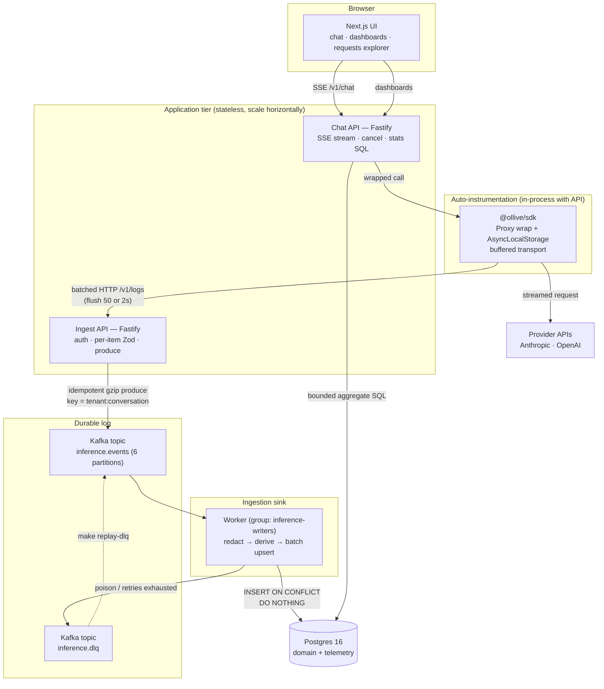
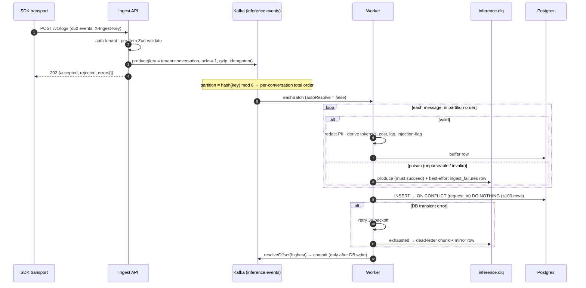
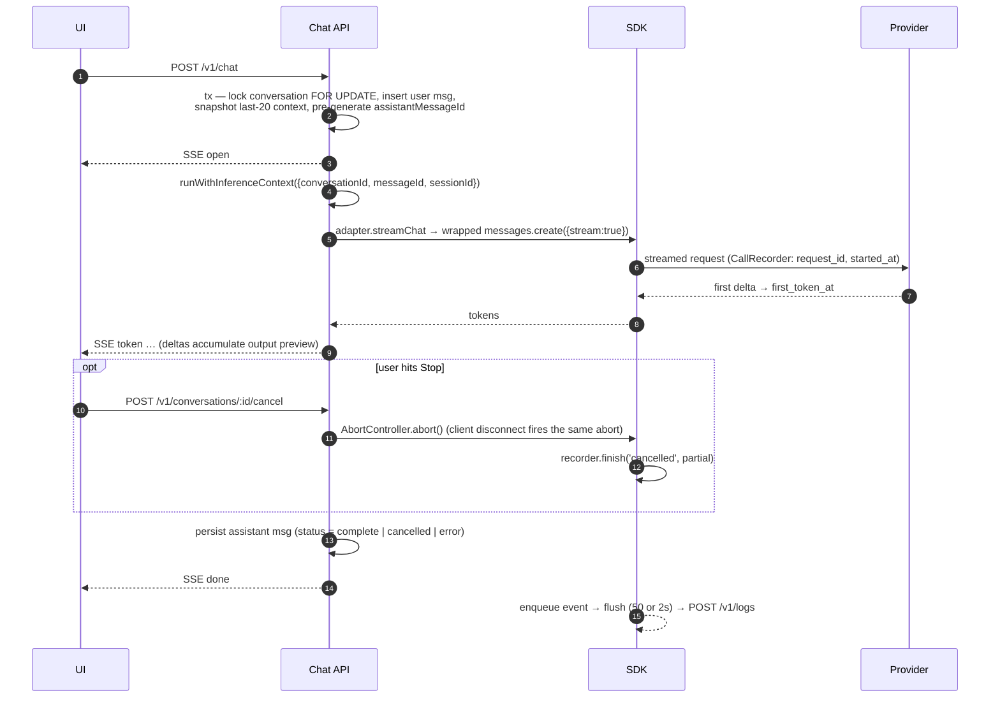

# Architecture Notes

An auto-instrumenting SDK intercepts provider calls transparently, ships events
over batched HTTP into Kafka, and an idempotent worker lands them in Postgres for
dashboards. Companion docs: [SCHEMA.md](SCHEMA.md) (data model),
[DESIGN-DECISIONS.md](DESIGN-DECISIONS.md) (trade-offs & rationale),
[LLD.md](LLD.md) (exact interfaces, Kafka config, captured query plans).

Two properties anchor every decision:

1. **Instrumentation can never hurt the host app.** The SDK never throws into, nor
   blocks on, the chat request path — telemetry degrades to counted drops.
2. **Logs are evidence.** Effectively-once landing via idempotent keys, observable
   duplicate rates, always-redacted storage, and dead-letters that are *replayable*
   rather than lost.

---

## System context

**Core stance:** `messages` is *domain data*, `inference_logs` is *telemetry*, and
they are intentionally decoupled — telemetry carries no FK into the domain. Logs
survive domain deletes, tolerate out-of-order arrival, and can come from *any*
instrumented app, not just this chat. Full reasoning in [SCHEMA.md](SCHEMA.md).

---

## Ingestion flow (hop by hop)

1. **Interception.** Provider clients are wrapped once, at construction
   (`apps/api/src/clients.ts`). A JS `Proxy` intercepts exactly one method path per
   provider (`messages.create`, `chat.completions.create`) — every call site is
   untouched. Streaming responses are themselves proxied so *consumption* is
   observed: first token stamps `first_token_at`, deltas accumulate the ≤500-char
   preview, usage is read from provider events, terminal status is classified
   success / error / cancelled (including aborts the provider SDK silently swallows).
2. **Correlation.** `AsyncLocalStorage`, entered at the chat-route boundary, carries
   `{conversationId, messageId, sessionId}`; the SDK reads it inside the wrapped
   call — no ids are threaded through adapters or call sites.
3. **Buffering.** The finished event (UUIDv7 `request_id`, timings, usage, previews)
   is enqueued into an in-memory transport: flush at 50 events or 2 s, POST to
   `/v1/logs` with `X-Ingest-Key`, 3 retries (exponential backoff + jitter),
   overflow (>1000) drops oldest. The SDK never throws or blocks the chat path.
4. **Ingest API** (separately deployable) authenticates the tenant key, caps the
   body at 1 MB, Zod-validates **each event independently** (accept valid, reject
   invalid → `202 {accepted, rejected, errors[]}`), and produces one gzip'd Kafka
   batch per HTTP batch — `acks: -1`, **idempotent producer**, key =
   `tenant:conversation_id` (fallback `request_id`). Ingest does **no DB writes**:
   producers stay fast and stateless; Kafka retention is the buffer.
5. **Kafka.** `inference.events`, 6 partitions: per-conversation ordering via keying,
   and up to 6 parallel workers without repartitioning. Local single-broker KRaft
   RF=1; prod = 3 brokers, RF=3, `min.insync.replicas=2` — a config change (the
   producer already sends `acks:-1`).
6. **Worker** (`inference-writers` group) consumes with `eachBatch` + manual offset
   resolution: parse+validate → redact PII → derive metadata → one multi-row
   `INSERT … ON CONFLICT (request_id) DO NOTHING` per ≤100 events → resolve offsets
   and commit **only after the DB write succeeds**. Heartbeats during long batches;
   consumer lag logged every 30 s.
7. **Dead-lettering & recovery.** Unparseable messages and DB-retry-exhausted chunks
   go to `inference.dlq` (canonical, with source topic/partition/offset + retry-count
   headers) plus a best-effort `ingest_failures` row for SQL triage. `make replay-dlq`
   re-drives replayable entries through the normal pipeline — safe to run repeatedly
   because the sink dedupes.

### Event lifecycle: SDK → Postgres

**Delivery semantics, stated plainly:** at-least-once delivery + idempotent
consumer = **effectively-once** outcome. Every hop may retry; the `request_id
UNIQUE` conflict clause absorbs all duplicates and the batch's `RETURNING` count
surfaces the redelivery volume as a metric (`duplicatesTotal`).

### Chat request lifecycle (with the cancel path)

The completion and provider-error paths differ only in terminal status and, on an
error with zero output, in skipping the assistant row. **The product path has no
backpressure coupling to telemetry at all** — chat latency never depends on any
ingestion component being up.

---

## Logging strategy

- **Auto-instrumentation, not manual logging.** There are no `log()` calls at call
  sites — wrapping the client at construction is the entire integration. The SDK is
  dependency-free of the provider SDKs (structural interception), so it instruments
  any client shaped like them.
- **Previews vs raw.** `input_preview` / `output_preview` are truncated to 500 chars
  for cheap listing/inspection; the full (redacted) event is kept in `raw jsonb` as
  a schema-evolution escape hatch — new SDK fields survive even before a migration
  promotes them to columns.
- **Redaction placement.** In the **worker**, before storage — `inference_logs` never
  stores unredacted content, whichever producer sent the event. Chat `messages` stay
  raw domain data (users own their history); `REDACT_MESSAGES=true` flips the API to
  redact domain content too.
- **Contract versioning.** Events carry `schema_version`; the Zod schema in
  `packages/shared` is the single source of truth for SDK, ingest, and worker.
- **Telemetry loss policy.** Telemetry never degrades the product: on sustained
  ingest/Kafka outage the SDK retries then drops (counted). The chat request path is
  unaffected by design.

---

## Scaling considerations

The design makes "scaling up is easy" structurally true — each step below is
configuration, not redesign:

- **API / ingest are stateless** → run N replicas behind a load balancer. The one
  in-memory structure (conversation → `AbortController` cancel map) has an optional
  Valkey pub/sub layer (`REDIS_URL`) so aborts fan out across replicas.
- **Workers scale to the partition count.** Partitions are the unit of parallelism:
  `docker compose up --scale worker=6` (or 6 pods) and the consumer group
  rebalances — zero code changes up to 6 workers. Beyond that, raise the partition
  count (an online operation; telemetry tolerates the hash redistribution).
- **Kafka** → 3 brokers, RF=3, `min.insync.replicas=2` — producer semantics already
  correct (`acks:-1`).
- **Postgres read path** → dashboards move to a read replica; writes stay on the
  primary (the worker is the only writer, already batched). pgbouncer goes in front
  before replica count climbs.
- **Documented next steps (deliberately not built):** time-based partitioning of
  `inference_logs` + a retention job (drop old partitions instead of DELETE); a BRIN
  index on `request_started_at` (naturally append-ordered — tiny index, same range
  scans); a `metrics_1m` rollup / continuous aggregate once raw-window scans slow;
  ClickHouse for the analytics path at ~100×, Postgres keeping the transactional
  role.

### Autoscaling signal

Workers should autoscale on **consumer lag**, not CPU — lag is the true backlog
gauge (a worker blocked on a slow DB shows low CPU but rising lag). The worker logs
lag every 30 s; in the AWS reference it maps to the MSK `PER_TOPIC_PER_PARTITION`
metric driving the scaling policy.

---

## Failure handling assumptions

The full chain, failure by failure:

| Failure | Behavior | Loss? |
|---|---|---|
| SDK buffer overflow (>1000) | Drop oldest, count in `dropped` | Yes — bounded, counted; chat unaffected |
| Ingest down / unreachable | SDK retries 3× (backoff+jitter), then drops | Only after retries; chat unaffected |
| Ingest key wrong / body too large (4xx) | SDK drops immediately (non-retryable) | Yes — counted |
| Kafka down | Ingest returns 503 (produces nothing, buffers nothing); SDK retries → drops | Only after SDK retries |
| Worker crash mid-batch | Offsets uncommitted → Kafka redelivers → `ON CONFLICT DO NOTHING` absorbs duplicates | None |
| Postgres down | Worker retries 3× with backoff; exhausted → DLQ + (best-effort) `ingest_failures`; offsets advance | None (replayable from DLQ) |
| Poison message (unparseable/invalid) | DLQ + `ingest_failures` row; pipeline keeps moving | None (preserved in DLQ) |
| Oversized poison (near broker cap) | DLQ send gzip'd; MESSAGE_TOO_LARGE → truncated copy (`truncated:true` header) | None — partition never wedges |
| Provider call fails / aborted | Event still emitted with status `error`/`cancelled`, partial preview, latency-so-far; partial message persisted | — (that's a feature) |
| Dashboard query > 5 s | `statement_timeout` aborts it; next poll retries | None — reads shed load, writer unaffected |

**Assumptions:** single-broker Kafka locally means broker loss loses in-flight
unconsumed events (accepted — Postgres is the durable store; prod posture is
replicated brokers). `ingest_failures` is best-effort when the DB itself is down
(the DLQ topic is canonical). Duplicate DLQ entries are possible under
crash-redelivery (at-least-once dead-lettering, deduplicable by Kafka offset).

---

## Capacity — back of the envelope

Assume **50 req/s peak**, diurnal average ~⅓ of peak (~17 req/s): **~1.5M
events/day** (4.3M/day if pinned at peak).

- **Row size** ~2 KB → **~3 GB/day** table growth at average; +30–40 % for indexes →
  **~4 GB/day** effective; **~120 GB over 30-day retention**. Partitioning becomes
  mandatory in week 2–3 at peak — for *retention* (drop a partition vs DELETE+vacuum),
  not query speed (indexes handle that).
- **Kafka:** 50 msg/s × ~1.2 KB ≈ 60 KB/s; 7-day retention ≈ 36 GB raw / ~10 GB
  compressed — trivial for one broker.
- **Measured (4-vCPU laptop VM):** ingest accepted **10,000 events in 0.94 s
  (~10,600 events/s)** with per-item validation + gzip + `acks:-1`; a **single
  worker** drained all 10,000 through redact→derive→batch-insert **0.7 s after the
  last POST**. The 50 ev/s target uses <1 % of one worker — 6 partitions is
  orders-of-magnitude headroom before any scaling step.
- **Dashboards:** window scans over a few million rows serve in single-digit ms
  (measured 0.3 ms over the demo set); a rollup table is the escape hatch past 100M
  rows.

---

## Grounding

The pipeline's stances map to published production patterns for this domain:

- **At-least-once + idempotent sink over Kafka transactions/EOS** — EOS covers only
  Kafka→Kafka flows; an external DB sink must be idempotent regardless, so telemetry
  pipelines standardize on key-based dedup (`INSERT … ON CONFLICT DO NOTHING`) with
  commit-after-write offsets. Same skeleton as Langfuse v3, Helicone, PostHog.
- **Bounded in-process retry → DLQ with provenance headers → replay tooling** — the
  recovery shape follows Uber's dead-letter pattern; tiered retry *topics* are the
  documented upgrade at much larger scale.
- **Event vocabulary** — the `InferenceEventV1` fields (model, provider, token usage,
  latency, streaming) deliberately mirror the emerging **OpenTelemetry GenAI
  semantic conventions** (`gen_ai.*`); exporting events as OTLP spans is a documented
  next step, making the pipeline interoperable with any OTel backend.

See [`docs/PRODUCTION.md`](PRODUCTION.md) for the cloud deployment plan, security
posture, and the ranked production-gap list.
