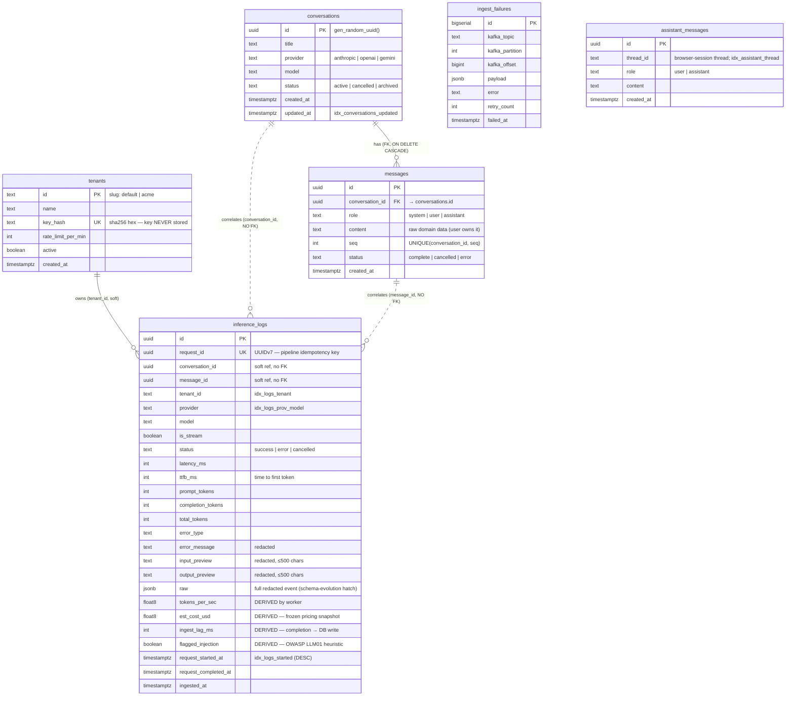

# Schema Design

The data model is split down one line: **`conversations` / `messages` are domain
data; `inference_logs` is telemetry.** That single decision — telemetry carries
*no* foreign key into the domain — is what makes the pipeline able to ingest
events from any instrumented app, survive domain deletes, and tolerate
out-of-order arrival. Everything below follows from it.

Source of truth is plain SQL in [`infra/migrations/`](../infra/migrations),
applied by an atomic runner (`migrate.sh`) with a `schema_migrations` tracking
table; the app reads through a Drizzle mirror for typed queries.

---

## Entity–relationship diagram

Solid lines are enforced foreign keys. **Dashed lines are *soft* correlations —
opaque ids, no FK constraint** — which is the whole point of the domain/telemetry
split.



*(`assistant_messages` stores the analytics-copilot Q&A history and stands alone —
it has no relationship to the inference domain, so it is drawn unconnected.)*

---

## The central decision: domain vs telemetry

| | `messages` (domain) | `inference_logs` (telemetry) |
|---|---|---|
| **Owns** | the conversation the user reads | the observability record of a model call |
| **FK to domain?** | yes — `conversation_id` cascades | **no** — `conversation_id`/`message_id` are opaque correlation ids |
| **Arrival order** | synchronous, in the request | asynchronous, may land *before* the message row commits |
| **Producer** | only this chat app | *any* app that wraps its client with the SDK |
| **On domain delete** | cascades away | **survives** — telemetry is not a child of the chat |
| **Redaction** | raw by default (user owns history) | always redacted before storage |

Why no FK on telemetry:

1. **Out-of-order tolerance.** The SDK flushes asynchronously (batched, retried). A
   log event can reach Postgres before — or without — the message row it refers
   to. A foreign key would reject it; a soft reference stores it and lets the UI
   join opportunistically.
2. **Multi-source ingestion.** The pipeline is a generic inference logger. A second
   service wrapping its Anthropic client emits events with `conversation_id`s this
   database has never seen. No FK ⇒ those land fine; an FK would make the logger
   coupled to one app's domain.
3. **Independent lifecycle.** Deleting a conversation (GDPR erase, cleanup) must not
   delete the cost/latency history the governance product exists to keep.

The price: joins between a log and its conversation are best-effort (`LEFT JOIN`),
and a log can reference a `conversation_id` with no matching row. For telemetry
that is correct — each event is a self-contained terminal fact.

---

## Table-by-table

### `conversations` / `messages` — domain
- Classic parent/child with `ON DELETE CASCADE`.
- **`UNIQUE (conversation_id, seq)`** does double duty: it enforces gap-free
  ordering *and* is the exact index the resume query walks
  (`WHERE conversation_id = $1 ORDER BY seq LIMIT 500`). Seq is assigned under a
  `SELECT … FOR UPDATE` on the conversation row, so concurrent sends can't collide.
- `messages.status` records partial outcomes: a cancelled or errored generation
  still persists whatever text streamed, tagged `cancelled` / `error`.

### `inference_logs` — telemetry
- **`request_id uuid UNIQUE`** is the idempotency key for the whole pipeline. It is
  minted once at event creation in the SDK (UUIDv7 — time-sortable, so inserts stay
  right-leaning and cache-friendly on the unique btree) and enforced at the sink
  with `INSERT … ON CONFLICT (request_id) DO NOTHING`. Any hop may deliver twice;
  the row count doesn't move.
- **SDK-sent columns** are the raw observation: provider, model, `is_stream`,
  `status`, timings (`latency_ms`, `ttfb_ms`), token usage, error info, and the two
  ≤500-char previews.
- **Worker-*derived* columns** are the "extracts useful metadata" deliverable —
  values the SDK never sends, computed at write time:
  - `tokens_per_sec` — generation speed (`completion_tokens` / generation seconds).
  - `est_cost_usd` — a per-event cost snapshot frozen from the pricing table at
    ingest. (Dashboards *also* price at query time via an `unnest` pricing join, so
    editing a price applies retroactively; this column is the immutable snapshot.)
  - `ingest_lag_ms` — request completion → DB write, i.e. the pipeline delay. This
    is the "near real time" claim made measurable (observed ~2 s ≈ the SDK flush
    interval).
  - `flagged_injection` — a heuristic prompt-injection verdict (OWASP LLM01). For a
    governance product, an attack *attempt* is evidence, so it becomes queryable
    telemetry with its own partial index and dashboard stat.
  - `tenant_id` — which tenant owns the event (defaults to `'default'`, the
    env-key bootstrap tenant).
- **`raw jsonb`** stores the full redacted event. It is the schema-evolution escape
  hatch: a new SDK field is queryable from `raw` immediately, even before a
  migration promotes it to a typed column.

### `tenants` — identity
- Keys are **never stored** — only their `sha256` hash (`key_hash UNIQUE`). A key is
  shown exactly once, at mint (`scripts/create-tenant.sh`). Ingest resolves a key
  against this table with a read-only pool + 60 s cache (10 s negative cache), so
  the hot path stays DB-free and unknown keys fail closed.
- `rate_limit_per_min` is the per-tenant budget; `active` allows soft revocation.

### `ingest_failures` — dead-letter mirror
- A SQL-queryable triage view of what the pipeline couldn't process: the Kafka
  coordinates (`topic`/`partition`/`offset`), the raw `payload`, the `error`, and a
  `retry_count`. It is **best-effort** — the `inference.dlq` Kafka topic is the
  canonical record (it survives even a Postgres outage); this table just makes
  routine triage a `SELECT` instead of a topic dump.

### `assistant_messages` — analytics copilot
- Persists the "explain my numbers" Q&A, threaded by a browser-session id so a
  user's history survives across visits. Independent of the inference tables.

---

## Query → index mapping

Every index exists because a specific query needs it — no speculative indexing.

| Read path (real SQL in `apps/api/src/routes/stats.ts`) | Served by |
|---|---|
| Any time-window aggregate — throughput/min, tokens, error rate, summary cards, percentiles | `idx_logs_started` — `(request_started_at DESC)` |
| Model-economics table filtered to a provider/model | `idx_logs_prov_model` — `(provider, model, request_started_at DESC)` |
| **Recent-errors table** (`status='error' ORDER BY started DESC LIMIT 50`) | **partial `idx_logs_errors`** — indexes only error rows, pre-ordered → the top-50 is a pure index walk (measured **0.12 ms**) |
| Flagged-input explorer (`WHERE flagged_injection`) | **partial `idx_logs_flagged`** — indexes only the <1 % flagged rows |
| Per-conversation drill-down (`/v1/logs?conversationId=`) | `idx_logs_conversation` |
| Per-tenant dashboards | `idx_logs_tenant` — `(tenant_id, request_started_at DESC)` |
| Worker upsert conflict check | `inference_logs_request_id_key` (UNIQUE) |
| Conversation list (`ORDER BY updated_at DESC LIMIT 100`) | `idx_conversations_updated` |
| Resume (`WHERE conversation_id ORDER BY seq LIMIT 500`) | `UNIQUE (conversation_id, seq)` |
| Copilot thread history | `idx_assistant_thread` — `(thread_id, created_at)` |

Two **partial** indexes (`idx_logs_errors`, `idx_logs_flagged`) are the highest-
leverage choice here: the interesting rows (errors, attacks) are a tiny fraction of
the table, so an index that contains *only* them is small, cache-resident, and
already in the required order — the query becomes a straight index walk with no
filter step. Captured plan for the recent-errors query:

```
Limit  (actual time=0.011..0.107 rows=50)
  -> Index Scan using idx_logs_errors on inference_logs (rows=50)
       Index Cond: (request_started_at >= now() - '24:00:00')
Execution Time: 0.120 ms
```

Every dashboard query is window-bounded (`request_started_at >= now() -
make_interval(...)`) and `LIMIT`ed, and runs under `SET LOCAL statement_timeout =
'5s'` in its own transaction — a runaway read sheds load instead of melting the
writer's database.

---

## Read-heavy or write-heavy? Both, on purpose

- **Write path (worker):** append-only, one writer, **batched** — a single
  multi-row `INSERT … ON CONFLICT DO NOTHING` of ≤100 rows per statement, never
  row-by-row. UUIDv7 keys keep the unique-index inserts right-leaning. Measured:
  10,000 events drained through redact→derive→insert **0.7 s after the last POST**.
- **Read path (dashboards):** aggregate scans over time windows, each backed by a
  purpose-built index and bounded by `LIMIT` + `statement_timeout`.

The two paths are decoupled at the storage layer and, in production, split
physically: the worker (sole writer) stays on the primary; dashboards move to a
read replica. That is a config change, not a redesign — see
[ARCHITECTURE.md §Scaling](ARCHITECTURE.md#scaling-considerations).

---

## Delivery semantics, stated precisely

> **At-least-once delivery + an idempotent sink = an effectively-once outcome.**

- The idempotency key (`request_id`, UUIDv7) is minted **once** at event creation
  and travels the entire pipeline unchanged.
- Every hop may retry: SDK HTTP retry, idempotent Kafka producer retry, consumer
  redelivery after a worker crash.
- Enforcement is at the **sink**: `request_id UNIQUE` + `ON CONFLICT DO NOTHING`.
  Duplicates are absorbed *and counted* — the batch insert uses `RETURNING`, so
  conflict-skipped rows surface as `duplicatesTotal` in the worker's 30 s stats
  line. Duplicates stay invisible to the data but visible as an operational metric.

Verified end-to-end in `scripts/smoke.sh` (idempotent-redelivery assertion) and by
kill-worker/catch-up tests.

---

## Migrations

| File | Adds |
|---|---|
| `0001_init.sql` | `conversations`, `messages`, `inference_logs`, `ingest_failures` + the four core indexes |
| `0002_derived_metadata.sql` | `tokens_per_sec`, `est_cost_usd`, `ingest_lag_ms`; `idx_conversations_updated` |
| `0003_guardrails.sql` | `flagged_injection` + partial `idx_logs_flagged` |
| `0004_tenants.sql` | `tenants` table; `tenant_id` + `idx_logs_tenant` |
| `0005_assistant.sql` | `assistant_messages` + `idx_assistant_thread` |

All migrations are additive (add-only columns default-backfilled), so they apply to
a live table without a rewrite — the same discipline the event contract follows
(`schema_version` + add-only-optional-fields).
